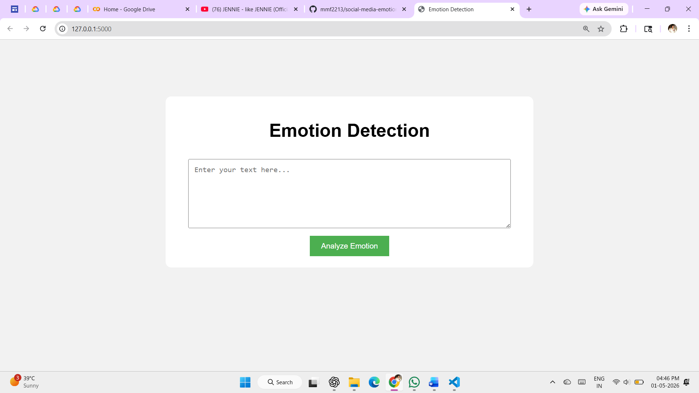
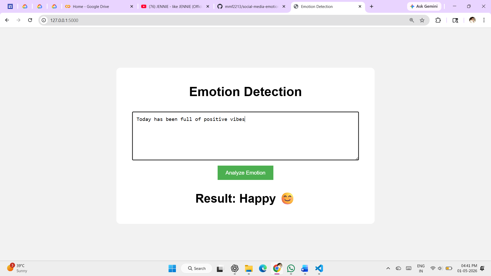
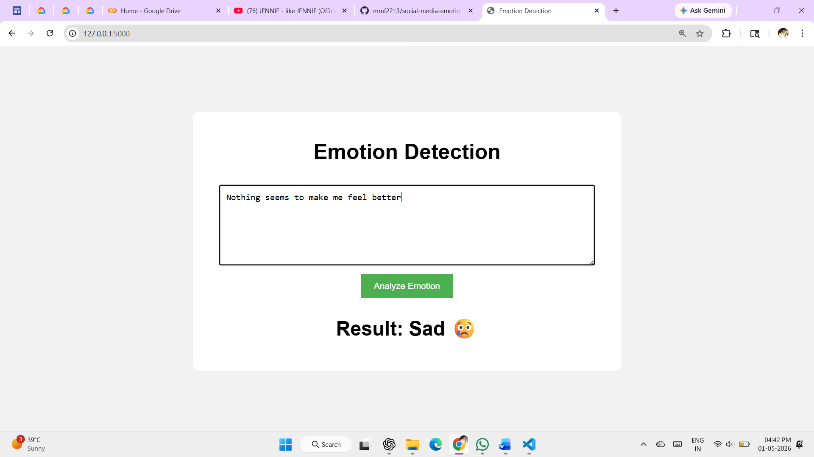
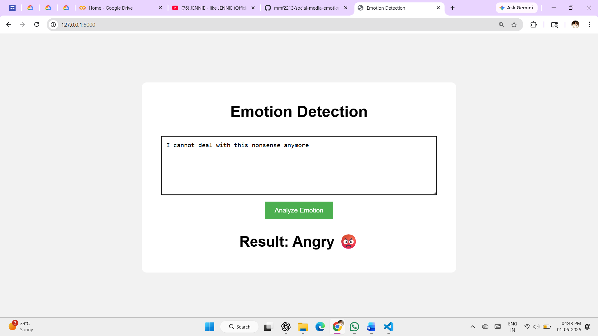
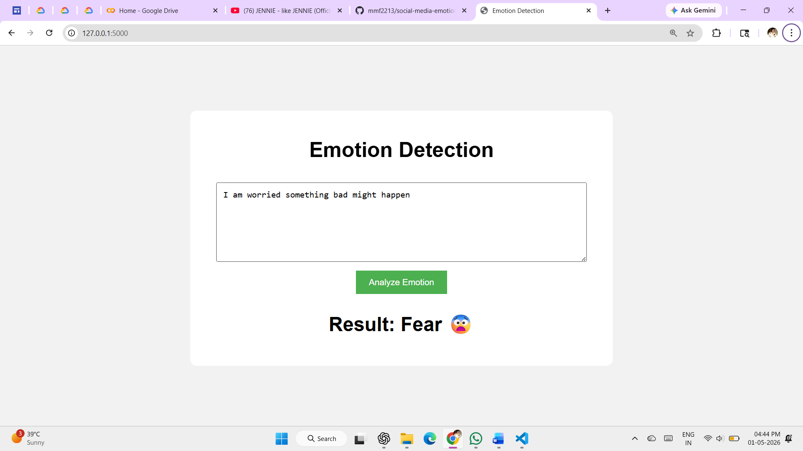
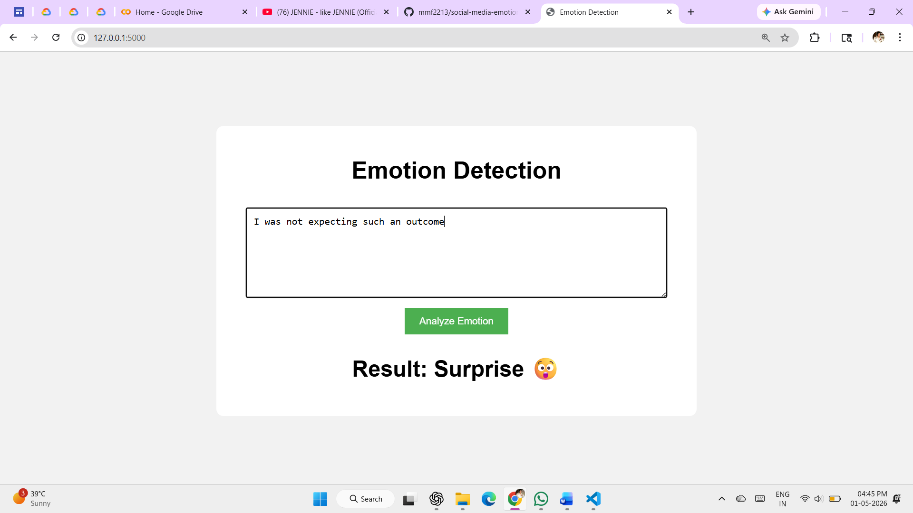

# Emotion Detection in Social Media Posts using Machine Learning with Web Interface

## 📌 Project Overview
This project is a Machine Learning-based web application that detects emotions from social media text. It classifies text into Happy, Sad, Angry, Fear, Surprise, and Neutral using NLP (TF-IDF) and Logistic Regression with a Flask web interface.

---

## 🚀 Features
- Real-time emotion detection from text  
- Multi-class emotion classification  
- Simple Flask web interface  
- Emoji-based output visualization  
- Fast and efficient prediction  

---

## 🛠️ Tech Stack
- Python  
- Flask  
- Scikit-learn  
- Pandas  
- HTML, CSS  

---

## 📂 Project Structure
```
emotion_project/
├── app.py
├── train_model.py
├── dataset.csv
├── model.pkl
├── vectorizer.pkl
│
├── templates/
│   └── index.html
│
├── static/
│   ├── style.css
│   └── screenshots/
│       ├── ui.png
│       ├── happy.png
│       ├── sad.png
│       ├── anger.png
│       ├── fear.png
│       └── surprise.png
│
└── README.md
```

---

## ⚙️ Installation & Setup

1. Clone the repository  
```bash
git clone https://github.com/your-username/emotion-detection-social-media.
```
```bash  
cd emotion-detection-social-media
```

2. Install dependencies
```bash
pip install flask scikit-learn pandas
```

3. Train the model
```bash
python train_model.py
```

4. Run the application
```bash  
python app.py
```

5. Open in browser
``` 
http://127.0.0.1:5000/
```

---

## 📸 Output Screenshots

### 🖥️ User Interface  


### 😊 Happy Emotion  


### 😢 Sad Emotion  


### 😡 Angry Emotion  


### 😨 Fear Emotion  


### 😲 Surprise Emotion  


---

## 🎯 Future Improvements
- Deep learning models (LSTM, BERT)  
- Multi-label emotion detection  
- Real-time social media integration  
- Improved UI/UX design  

---

## 👤 Author
**Pooja Chanshetti**

---

## 📄 License
This project is for educational purposes only.
